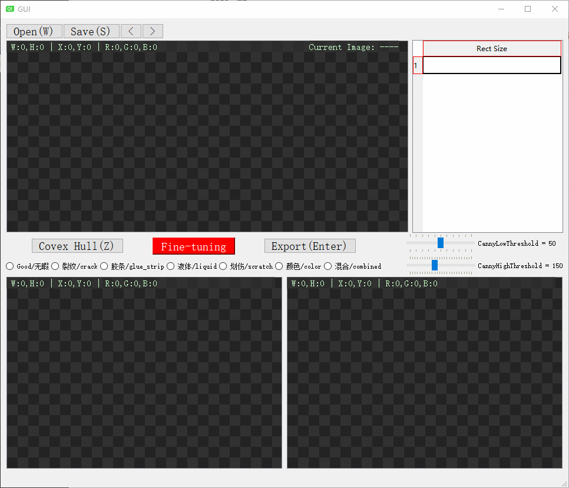
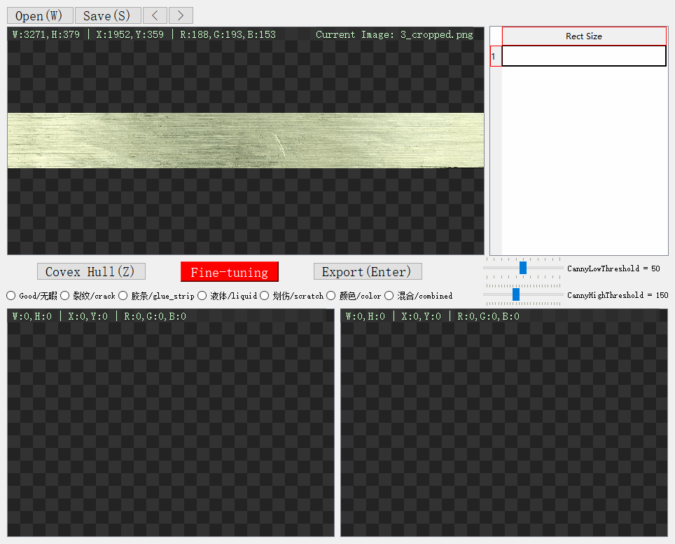
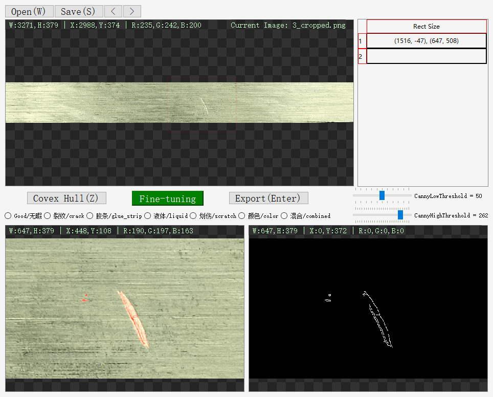
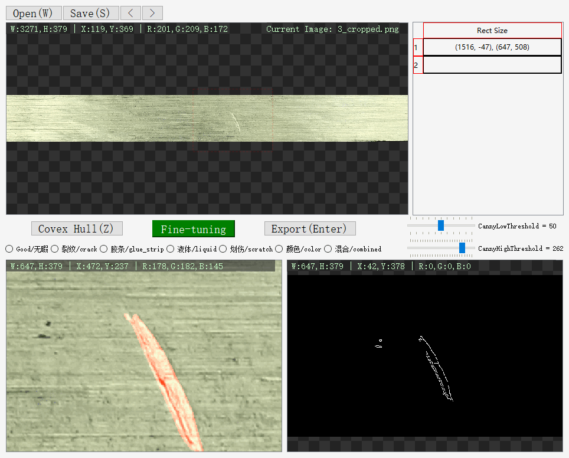

# 简介

在`Windows`下使用`OpenCV-4.6.0`和`Qt-5.14.2`开发的异常检测数据集制作小工具, 特别适用于 **布匹** 或 **金属** 表面纹理缺陷的 **掩膜** (*Mask*) 制作.

# 使用流程

1. 打开待标注素材文件夹 (快捷键: `W`)

   

   

2. 框选素材图片, 并按`S`键保存生成框选区域的特写和二值轮廓图, 可以拖动`Slider`调整`Canny`边缘检测的高低阈值, 最后按`Z`键生成凸包掩膜:

   

   

3. 如果有噪声轮廓要剔除或增添轮廓, 使用 "Fine-tuning" 按钮微调:

   

   

   

   

4. 最后选择缺陷类型并点击`Export`导出掩膜:

   

